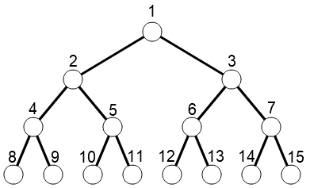

# A

## Problem Statement

Determine if there is a segment that directly connects the pointsnumbered *a* and *b* in the figure below.



## Constraints

- 1≤*a*<*b*≤15
- *a* and *b* are integers.

## Code
```cpp
#include<cstdio>
using namespace std;
int a,b;
int main(){
	scanf("%d%d",&a,&b);
	if(a == b/2 || b == a/2) printf("Yes");
	else printf("No");
	return 0;
}
```